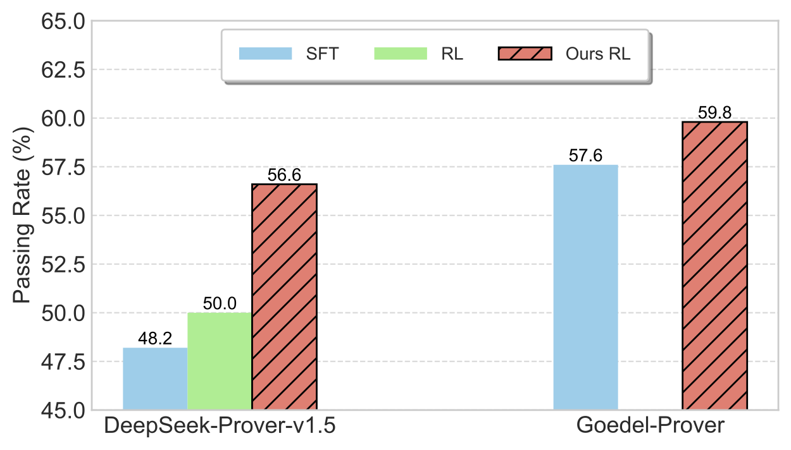

# Leanabell-Prover


[]((https://github.com/Leanabell-LM/Leanabell-Prover/graphs/commit-activity))


**[[arXiv]](https://arxiv.org/abs/2504.06122) | [[Codes]](https://github.com/Leanabell-LM/Leanabell-Prover) | [[🤗 Huggingface]](https://huggingface.co/collections/stoney0062/leanabell-prover-67fe4fae1dcf1d7221e309e9)** <br> 
Jingyuan Zhang, Qi Wang, Xingguang Ji, Yahui Liu, Yang Yue, Fuzheng Zhang, Di Zhang, Guorui Zhou, Kun Gai <br>
Kuaishou Technology <br>


## 1.Introduction 
Recent advances in automated theorem proving (ATP) through LLMs have highlighted the potential of formal reasoning with Lean 4 codes. However, ATP has not yet be revolutionized by the recent posttraining scaling as demonstrated by Open AI O1/O3 and Deepseek R1. In this work, we investigate the entire posttraining of ATP, aiming to align it with breakthroughs in reasoning models in natural languages. To begin, we continual train current ATP models with a hybrid dataset, which consists of numerous statement-proof pairs, and additional data aimed at incorporating cognitive behaviors that emulate human reasoning and hypothesis refinement. Next, we explore reinforcement learning with the use of outcome reward returned by Lean 4 compiler. Through our designed continual training and reinforcement learning processes, we have successfully improved existing formal provers, including both DeepSeek-Prover-v1.5 and Goedel-Prover, achieving state-of-the-art performance in the field of whole-proof generation. For example, we achieve a 59.8% pass rate (pass@32) on MiniF2F. This is an on-going project and we will progressively update our findings, release our data and training details.


<p align="center">

<br>
</p>


## 2.Evaluation Results


<div align="center">

| Model |Compute (Pass)|  miniF2F-test  |
|------------------------|------------------|------------------|
| TheoremLamma | 128 | 33.6% |
| DeepSeek-Prover-V1 | 32 | 46.1% |
| DeepSeek-Prover-V1.5-SFT | 32 | 48.2% |
| DeepSeek-Prover-V1.5-RL | 32 | 50.0% |
| Goedel-Prover-SFT | 32 | 57.6% |
| Leanabell-Prover-DS-SFT | 32 | 54.9% |
| Leanabell-Prover-DS-RL | 32 | 56.6% |
| Leanabell-Prover-GD-SFT | 32 | 58.2% |
| **Leanabell-Prover-GD-RL** | **32** | **59.8%** |
|------------------------|------------------|------------------|
| DeepSeek-Prover-V1.5-SFT | 64 | 53.3% |
| DeepSeek-Prover-V1.5-RL | 64 | 54.9% |
| Goedel-Prover-SFT | 64 | 62.7% |
| Leanabell-Prover-DS-SFT | 64 | 55.3% |
| Leanabell-Prover-DS-RL | 64 | 57.4% |
| Leanabell-Prover-GD-SFT | 64 | 59.0% |
| **Leanabell-Prover-GD-RL** | **64** | **60.7%** |
|------------------------|------------------|------------------|
| DeepSeek-Prover-V1.5-SFT | 128 | 50.4% |
| DeepSeek-Prover-V1.5-RL | 128 | 51.6% |
| STP | 128 | 57.7% |
| Leanabell-Prover-DS-SFT | 128 | 56.7% |
| Leanabell-Prover-DS-RL | 128 | 59.0% |
| Leanabell-Prover-GD-SFT | 128 | 59.4% |
| **Leanabell-Prover-GD-RL** | **128** | **61.1%** |
</div>
**Caption:** Comparison of Leanabell-Prover with existing methods for whole proof generation on miniF2F, assessing performance across various inference time computations.

## 3. Model and Dataset Downloads

We release the Goedel-Prover-SFT with 7B parameters to the public. Goedel-Prover-SFT is finetuned based on DeepSeek-Prover-V1.5-Base.

<div align="center">

|            **Model**            |                          **Download**                         |
| :-----------------------------: | :----------------------------------------------------------: |
|   Leanabell-Prover-DS-SFT   | [🤗 HuggingFace](https://huggingface.co/stoney0062/Leanabell-Prover-DS-SFT)|
|   Leanabell-Prover-DS-RL   | [🤗 HuggingFace](https://huggingface.co/stoney0062/Leanabell-Prover-DS-RL)|
|   Leanabell-Prover-GD-SFT   | [🤗 HuggingFace](https://huggingface.co/stoney0062/Leanabell-Prover-GD-SFT)|
|   Leanabell-Prover-GD-RL   | [🤗 HuggingFace](https://huggingface.co/stoney0062/Leanabell-Prover-GD-RL)|
</div>

We are also releasing 140K formal statements and 22K high-quality proofs of the formal problems:

- [Formal Statements](https://huggingface.co/datasets/stoney0062/Leanabell-Prover-Formal-Statement)
- [SFT training set](https://huggingface.co/collections/stoney0062/leanabell-prover-67fe4fae1dcf1d7221e309e9)


## 4. Setup Environment

//TODO

## 5. Citation
```latex
@article{zhang2025leanabell,
  title={Leanabell-Prover: Posttraining Scaling in Formal Reasoning},
  author={Zhang, Jingyuan and Wang, Qi and Ji, Xingguang and Liu, Yahui and Yue, Yang and Zhang, Fuzheng and Zhang, Di and Zhou, Guorui and Gai, Kun},
  journal={arXiv preprint arXiv:2504.06122},
  year={2025}
}
```

## 6. Contact

If you have any questions, please raise an issue or contact us at [yahui.cvrs@gmail.com](mailto:yahui.cvrs@gmail.com).

The primary architecture of this project is based on [DeepSeek-Prover-V1.5-RL](https://github.com/deepseek-ai/DeepSeek-Prover-V1.5.git) and [Goedel-Prover](https://github.com/Goedel-LM/Goedel-Prover.git). Certain sections of the code have been sourced from DeepSeek-Prover-V1.5-RL, as noted within the code files. The copyright for those sections belongs to [DeepSeek-Prover-V1.5](https://github.com/deepseek-ai/DeepSeek-Prover-V1.5.git).
